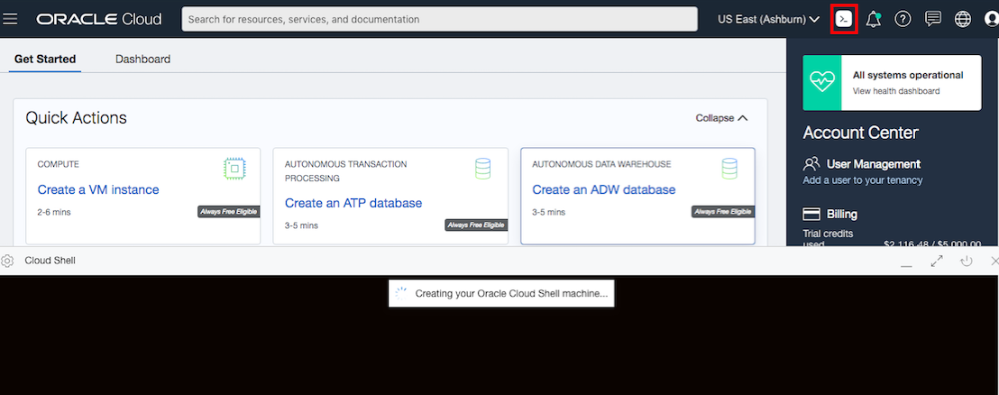
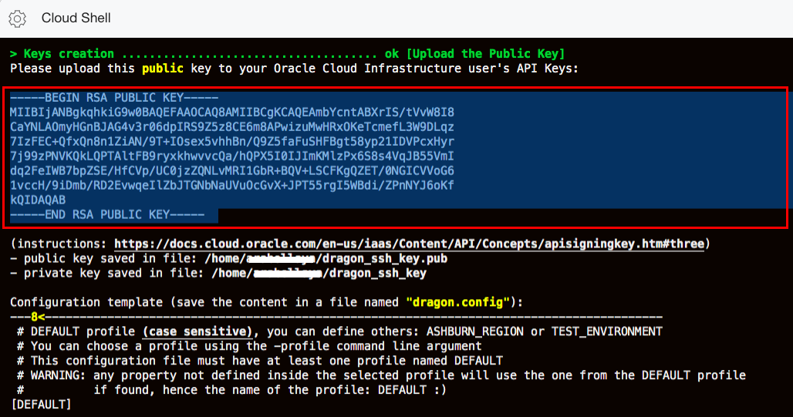
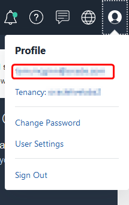
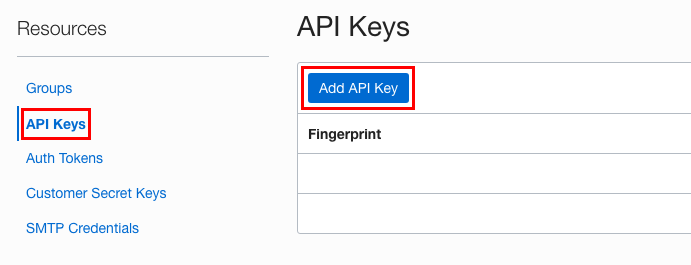
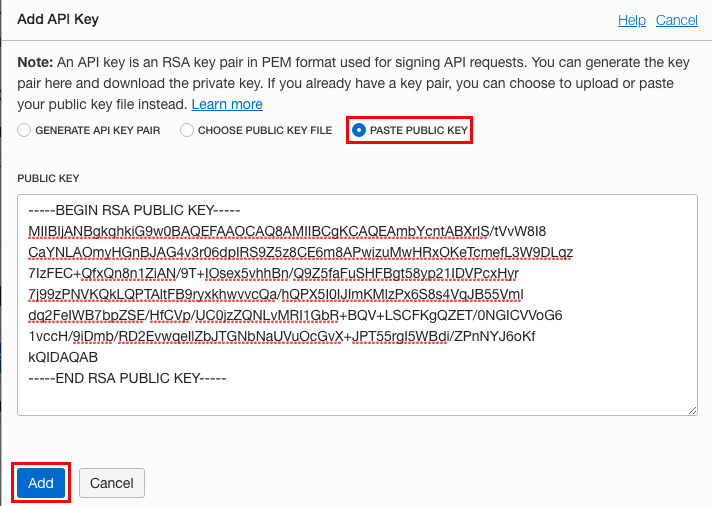
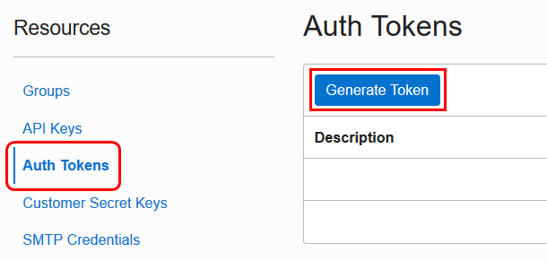
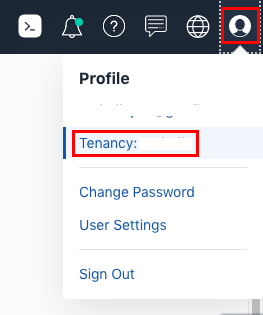
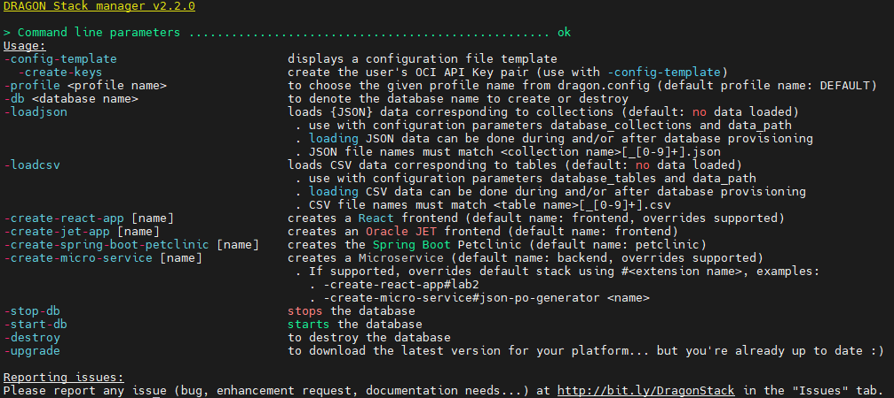
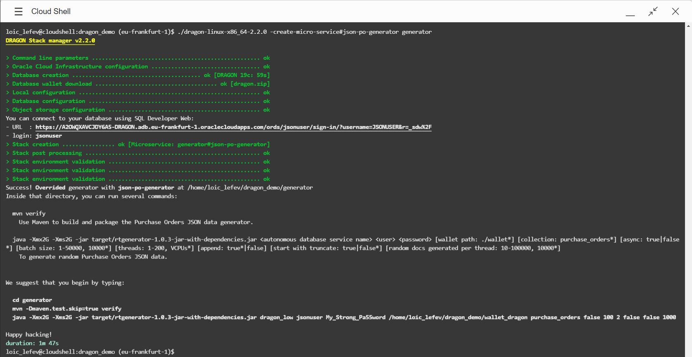
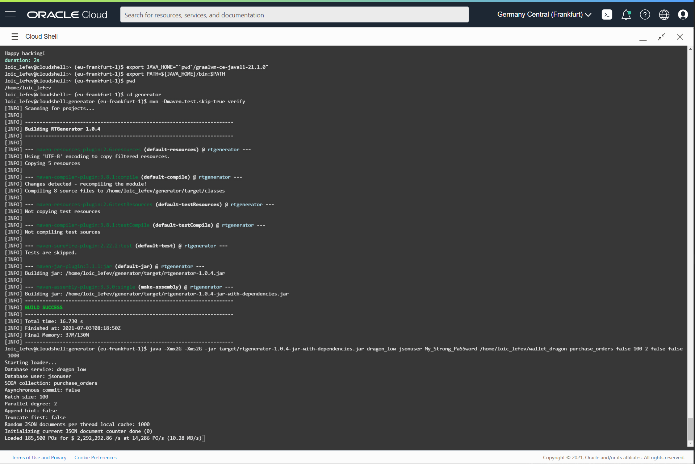

# Setup your environment

## Autonomous Database to store all your data: JSON and Relational

The very first cloud service that you'll need is a database, an Oracle *Autonomous Database* that will ease a lot of the tasks
related to data management. We'll also introduce a JSON data generator.

### Objectives

In this lab, you will:
- deploy an Autonomous database using the DRAGON Stack manager
- deploy a JSON documents generator as a micro-service

### Prerequisites

* An Oracle Cloud Account - Please view this workshop's LiveLabs landing page to see which environments are supported

## Introducing MoviE-Commerce

MoviE-Commerce is a startup selling movies online. As part of their strategy, MoviE-Commerce website is being built 100% on cloud
computing infrastructure.

You are one of the developers recently recruited, and you've been assigned to the e-shop development team. This is your
first week, your first JIRA issues are awaiting you..., but you're not alone: Oracle Cloud Services and Oracle Technologies
will help you.

### DRAGON Stack manager to the rescue

The easiest way to set up these 2 components of your architecture will be to use the [DRAGON Stack manager](https://bit.ly/DRAGONStackManager). 

The DRAGON Stack manager is an open-source project which provides the fastest way to build and run applications connected to an Autonomous Database shared infrastructure. It can indeed:
- provision and configure an Autonomous Database as well as load JSON and CSV data into collections and tables while taking care of the side resources such as Oracle Cloud Infrastructure Object Storage buckets
- integrates SQL Developer Web and Oracle REST Data Services (ORDS) integration with standard application development frameworks such as React, Oracle JET, Spring-Boot...
- generates project source code to start coding as soon as possible!  

## **STEP 1**: Download the DRAGON Stack manager

1. Launch the cloud shell terminal.
   

2. In Cloud Shell, change directories to your home directory:

    ```
    $ <copy>cd</copy>
    ```

3. If you have an existing DRAGON Stack manager you can simply *upgrade* it to the latest version:

    ```
    $ <copy>dragon-linux-x86_64-<your version> -upgrade</copy>
    ```

   For example:

   

   

   *[Click here to skip to STEP 4](#STEP4:DeploytheDRAGONStack)*

4. Download the DRAGON Stack manager and make it executable:
   *See [the GitHub repo](https://github.com/loiclefevre/dragon) for the latest version.*

    ```
    $ <copy>wget https://github.com/loiclefevre/dragon/releases/download/v2.2.0/dragon-linux-x86_64-2.2.0</copy>
    ```

    ```
    $ <copy>chmod +x dragon-linux-*</copy>
    ```

5. Run the dragon command to generate SSH keys and display the config file:

    ```
    $ <copy>./dragon-linux-x86_64-2.2.0 -config-template -create-keys</copy>
    DRAGON Stack manager v2.2.0

    > Command line parameters ................................................... ok
    Entering keys generation process...
    These keys (public and private) will be used for future connection to Oracle Cloud Infrastructure API endpoints.
    Please enter a passphrase: &lt;enter a passphrase&gt;
    > Keys creation ..................................... ok [Upload the Public Key]
    Please upload this public key to your Oracle Cloud Infrastructure user's API Keys:

    -----BEGIN RSA PUBLIC KEY-----
    MIIBIjANBgkqhkiG9w0BAQEFAAOCAQ8AMIIBCgKCAQEAsJthzZ9NzhJiFL/iC7nK
    bJlBQbTrsyDkc0zF0impJ5h9U/hCPopsKl53aBlaTTYjHnY73zaR/cJXbvsfbIJk
    v4USZpC/uhczo16BOtE3W+iQjoLgn8gsiFrcXvsb3G9h2avSa6eI1KifjJ7gqvEv
    SEb8t0ztMOkV3e3S5hrX57itipZZ0tPn//eBk8HpuHWV2wDoLtmzX2ZnIlu/niAO
    Fr7qTSvkVm28YEDAXEtQZ43C2wzImpacqiH37mK6fiK0Vunbx3D1bB+1a+dM6wVz
    09oXAIeD7lVROHpHHmqfb+AGbhEpsif005SE6mGgLxxSoRegWdVPKaLvZudpwlc8
    swIDAQAB
    -----END RSA PUBLIC KEY-----

    (instructions: https://docs.cloud.oracle.com/en-us/iaas/Content/API/Concepts/apisigningkey.htm#three)
    - public key saved in file: /home/tom_mcginn/dragon_ssh_key.pub
    - private key saved in file: /home/tom_mcginn/dragon_ssh_key

    Configuration template (save the content in a file named "dragon.config"):
    ...

     # Uncomment to ask for Bring Your Own Licenses model (doesn't work for Always Free and AJD)
    # database_license_type=byol

     # A list of coma separated JSON collection name(s) that you wish to get right after database creation
    # database_collections=

     # Path to a folder where data to load into collections can be found (default to current directory)
    data_path=.

    ```

6. Copy the public key (from the BEGIN RSA PUBLIC KEY to the end of END RSA PUBLIC KEY, including the dashes).

   

## **STEP 2:** Gather Data you need

1. From the OCI console, click the user icon (top right of your browser) and click **User Settings**. Click **API Keys** and **Add API Key**.

   
   

2. Select **Paste Public Keys** and paste the content of the public key you created and click **Add**. A new finger print will be generated.

   

Make a note of the fingerprint for later.

To see more information about generating the keys and finding your OCIDs, refer to [API Signing Key](https://docs.cloud.oracle.com/en-us/iaas/Content/API/Concepts/apisigningkey.htm).

3. Click on **Auth Tokens** and click **Generate Token** to create an Authentication token.

    

4. Enter a description and click **Generate Token**. Click **Copy** to save the token to the clipboard and then click **Close**.

    

    

Save the auth token for later.

5. On the User Details page, copy the user OCID and save it for later:

    

6. Click on the user icon again and click **Tenancy: <tenancy-name>**, then copy and save the tenancy OCID for later:

    
    

7. If you are using a LiveLabs reservation, your compartment OCID is provided on your reservation page. If you are using a Free Trial or Customer-owned tenancy, from your compartment details page, copy the compartment OCID and save it for later.

    

8. Look in the upper right of the Oracle Cloud Console to determine your region, then use [this reference](https://docs.cloud.oracle.com/en-us/iaas/Content/General/Concepts/regions.htm#top) to determine your region code. Save it for later.

## **STEP 3:** Create the dragon.config file

1. Create a `dragon.config` file using vi, nano or your favorite editor:

    ```
    $ <copy>nano dragon.config</copy>
    ```

2. Copy the following and paste it into the file, and add the values you collected earlier:

    /!\ FOR RESERVED TENANTS (Green Button): Please, check the remark just after this block.

    ```
    <copy>
    [DEFAULT]
    user=<user ocid>
    fingerprint=<api key fingerprint>
    key_file=~/dragon_ssh_key
    pass_phrase=<your passphrase>
    tenancy=<tenancy ocid>
    compartment_id=<compartment ocid>
    region=<region code>
    auth_token=<authentication token>
    database_user_name=jsonuser
    database_password=5uPeR_5tRoNg_PaSsWoRd
    database_collections=purchase_orders
    </copy>
    ```

   /!\ FOR RESERVED TENANTS (Green Button): Please, verify that you've chosen to deploy an ATP-S database and not an Always Free one! E.g. add this additional configuration parameter:

   ```
   <copy>
   database_type=atp
   </copy> 
   ```

   *Remark: the JSON data being used will be stored inside the **purchase_orders** collection.*

## **STEP 4:** Deploy the DRAGON Stack

1. Use the `-help` to see the parameters that DRAGON accepts:

    ```
    $ <copy>./dragon-linux-x86_64-2.2.0 -help</copy>
    ```

   


2. Create the DRAGON Stack along the Purchase Orders JSON generator:

   The following command will use the configuration information from the `dragon.config` file in order to deploy an

    ```
    $ <copy>./dragon-linux-x86_64-2.2.0 -create-micro-service#json-po-generator generator</copy>
    ```

   

   Remark the URL and the login resulting from the provisioning steps. You can use these to directly log into SQL Developer Web (aka SQL Database Action).
   
   See **Lab 3**.


3. If your tenancy has reached its limit for available Always Free Databases, you can change the type of the database to provision using the `database_type` parameter and try again. For example, this file uses an Autonomous Transaction Processing database (ATP).

    ```
    <copy>
    [DEFAULT]
    user=<user ocid>
    fingerprint=<api key fingerprint>
    key_file=~/dragon_ssh_key
    pass_phrase=<your passphrase>
    tenancy=<tenancy ocid>
    compartment_id=<compartment ocid>
    region=<region code>
    auth_token=<authentication token>
    database_user_name=jsonuser
    database_password=5uPeR_5tRoNg_PaSsWoRd
    database_collections=employees
    database_type=atp
    </copy>
    ```

4. Follow the instructions given at the very end of the process in order to finish the deployment:

    ```
    $ <copy>cd generator</copy>
    ```
 
    ```
    $ <copy>mvn -Dmaven.test.skip=true verify</copy>
    ```
   
5. You can try running the JSON generator right now using default parameters (please use the command given as the output of the stack creation):

    ```
    $ <copy>java -Xmx2G -Xms2G -jar target/rtgenerator-1.0.3-jar-with-dependencies.jar dragon_low jsonuser My_Strong_Pa55word /home/loic_lefev/dragon_demo/wallet_dragon purchase_orders false 100 2 false false 1000</copy>
    ```
    
    The very first action that the data loader will do is to open the `purchase_orders` collection to start loading data. 
   
    **In the case the collection doesn't exist (like for the first run), then it will be created.**

    You should see the generator loading data into the purchase_orders collection:

    

You may now [proceed to the next lab](#next): Understanding best practices for JSON data loading...

## Learn More

* [DRAGON Project (GitHub)](https://bit.ly/DRAGONStack) and add a star :)

## Acknowledgements
* **Author** - Loic Lefevre, Principal Product Manager
* **Last Updated By/Date** - Loic Lefevre, Principal Product Manager, June 2021


