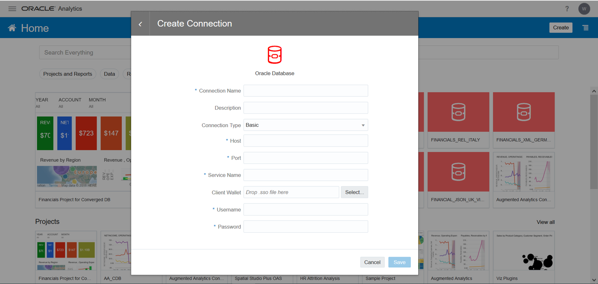

# Initialize Environment

## Introduction

In this lab we will review and startup all components required to successfully run this workshop.

*Estimated Lab Time:* 10 Minutes.

### Objectives
- Initialize the workshop environment.

### Prerequisites
This lab assumes you have:
- A Free Tier, Paid or LiveLabs Oracle Cloud account
- SSH Private Key to access the host via SSH
- You have completed:
    - Lab: Generate SSH Keys (*Free-tier* and *Paid Tenants* only)
    - Lab: Prepare Setup (*Free-tier* and *Paid Tenants* only)
    - Lab: Environment Setup

## **STEP 1:** Start And Validate The Required Processes are Up and Running.
1. Now with access to your remote desktop session, proceed as indicated below to Start your environment using Environment script before you start executing the subsequent labs and validate the following Processes should be up and running:
    
    - Database Listeners
    - Database Server Instances
    - OAS Services

2. To launch *Firefox* browser or a *Terminal* client, click on respective icon on the remote desktop

    

## **STEP 2**: Starting Database And OAS Services
1. From any of the terminal session started above, proceed as shown below.

2. Go to folder /u01/script

    ```
    <copy>
    cd /u01/script
    </copy>
    ```
3. Run the script file to start the services. All the required services of converged database and OAS will start in 5-6 minutes.

    

    ```
    <copy>
    ./env_setup_oas-workshop.sh
    </copy>
    ```

    
Check for the "Finished starting servers" status before proceeding next.

4. Run "status.sh" file to get the status of all the services required for OAS. The command shows all the service names and their status.

    
    ```
    <copy>
    /u01/oas/Oracle/middleware/Oracle_Home/user_projects/domains/bi/bitools/bin/status.sh
    </copy>
    ```

    
Check for the success status as shown above, before login to OAS screen.

## **STEP 3**: Login To Oracle Analytics Server

1. Open web browser (preferably Chrome) and access the OAS Data Visualization service by the below URL structure.  

    ```
    <copy>
    http://[Instance-public-ip]:9502/dv/ui
    </copy>
    ```
    

2. Login with the below credentials;

    ```
    Username	: <copy>Weblogic</copy>
    ```

    ```
    Password	: <copy>Oracle_4U</copy>
    ```

## **STEP 4**: Create A Connection To Database

1. From Home screen, click on **Create** button and select **Connection**.

    

2. Select **Oracle Database** for connecting to database and provide required connection details.  

    
    

    **Connection Details:**

    | Argument  | Description   |
    | ------------- | ------------- |
    | Connection Name | ConvergedDB_Retail |
    | Connection Type | Basic  |
    | Host | localhost  |
    | Port | 1521  |
    | Service Name | apppdb  |
    | Username | oaslabs  |
    | Password | Oracle_4U  |

3. Once connection details are provided click **Save** to save the connection.

You may now [proceed to the next lab](#next).

## Acknowledgements

- **Authors** - Balasubramanian Ramamoorthy, Sudip Bandyopadhyay, Vishwanath Venkatachalaiah
- **Contributors** - Jyotsana Rawat, Satya Pranavi Manthena, Kowshik Nittala, Rene Fontcha
- **Last Updated By/Date** - Rene Fontcha, LiveLabs Platform Lead, NA Technology, December 2020
