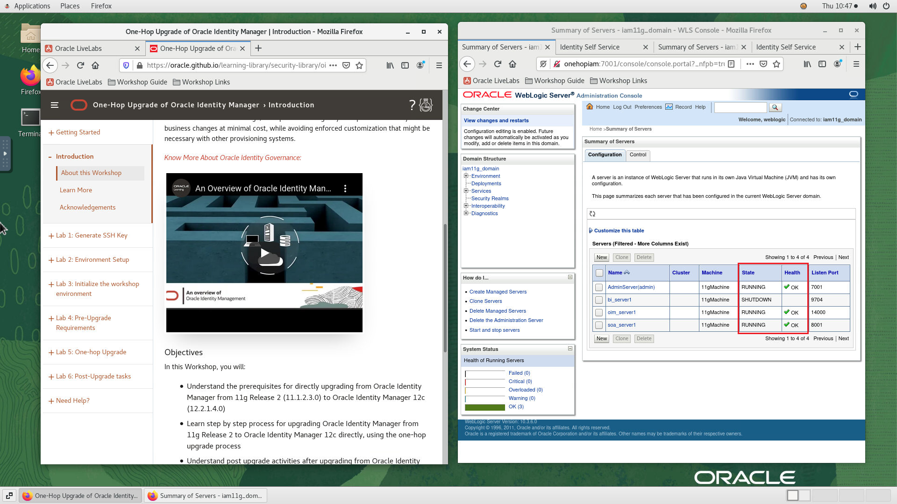
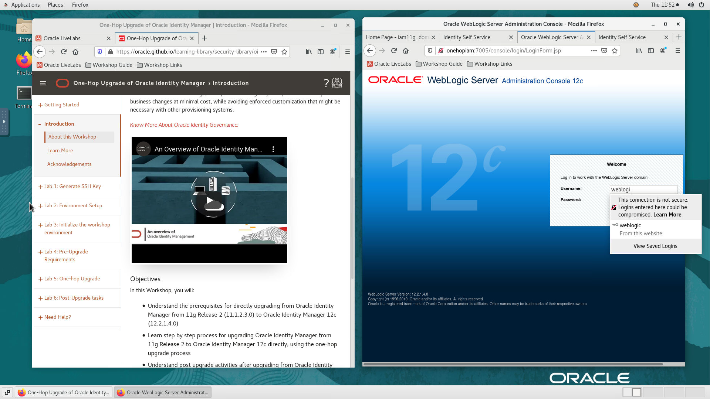
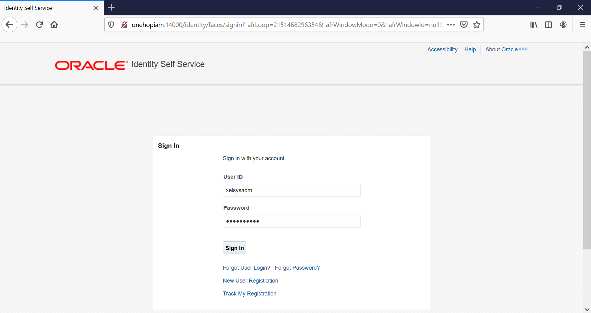
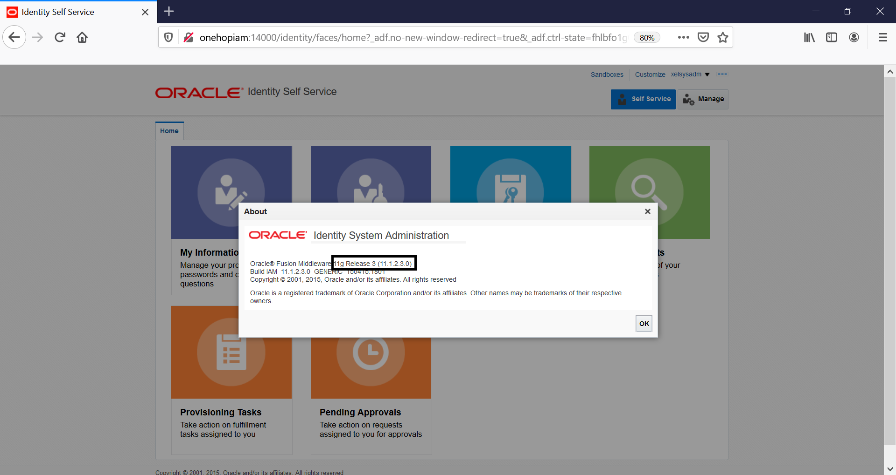
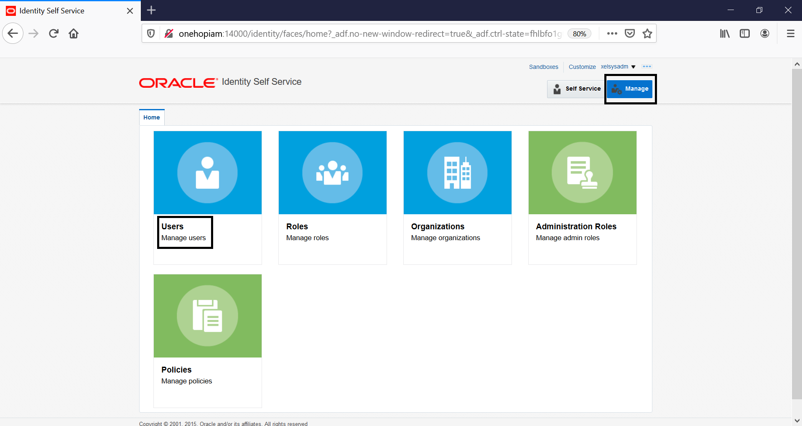
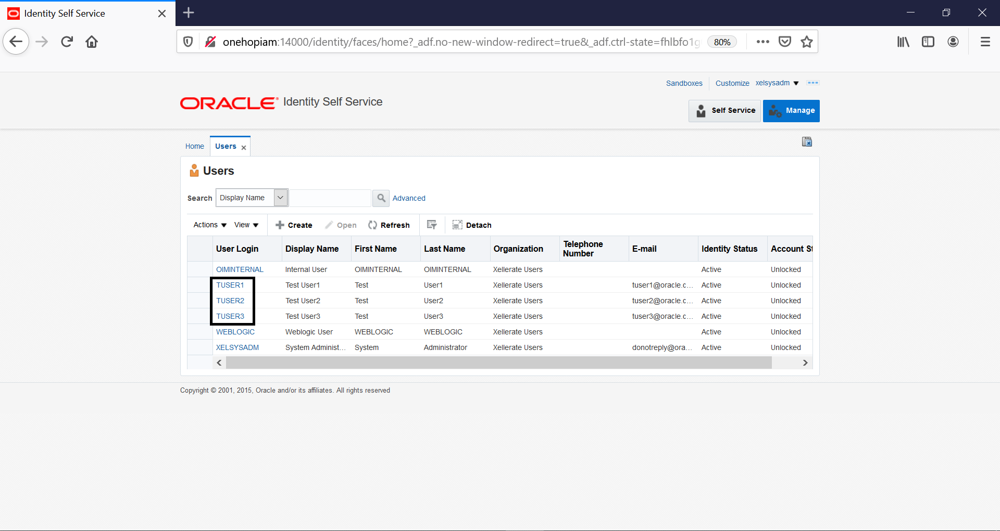
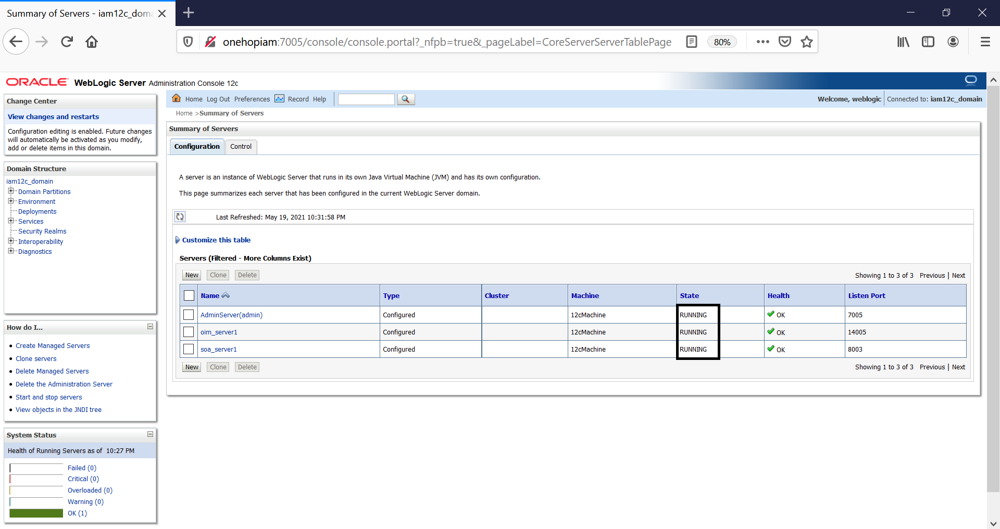
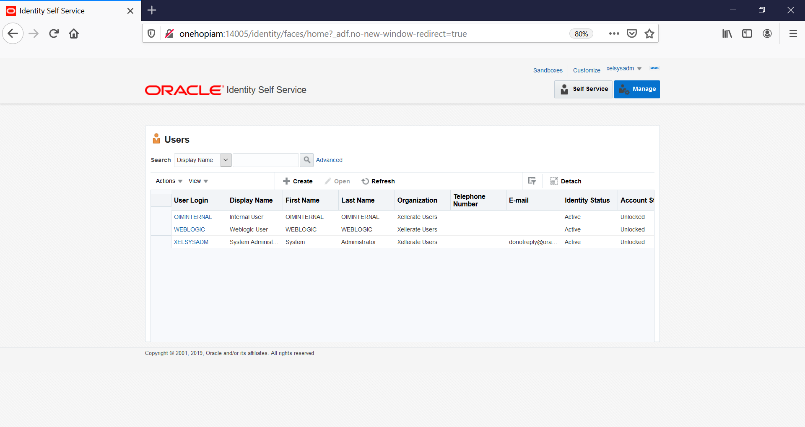

# Initialize Environment

## Introduction

In this lab we will review and startup all components required to successfully run this workshop.

*Estimated Lab Time*: 20 minutes

### About Product/Technology
Oracle Identity Governance(OIG) is a powerful and flexible enterprise identity management system that automatically manages user's access privileges within enterprise IT resources.

### Objectives

In this lab, you will:
* Initialize the workshop environment.
* Verify the database Status.
* Verify the status of 11g Domain available for upgrade.
* Verify the status of 12c Domain.

### Prerequisites

* An Oracle Cloud Account - Please view this workshop's LiveLabs landing page to see which environments are supported
* SSH Private Key to access the host via SSH

*Note: If you have a **Free Trial** account, when your Free Trial expires your account will be converted to an **Always Free** account. You will not be able to conduct Free Tier workshops unless the Always Free environment is available. **[Click here for the Free Tier FAQ page.](https://www.oracle.com/cloud/free/faq.html)***


## **STEP 1:** Validate That Required Processes are Up and Running.
1. Now with access to your remote desktop session, proceed as indicated below to validate your environment before you start executing the subsequent labs. The following Processes should be up and running:

    - Database Listener
    - Database Server
    - Admin Server (Admin server will take about 3-4 mins to start)
    - OIM & SOA Server (SOA and OIM servers will take 10-12mins to start)

2. On the *Firefox* window on the right preloaded Weblogic 11g console, if not then refresh the page or wait 2-3min to start Admin server then click on the *Username* field and select the saved credentials to login. These credentials have been saved within *Firefox* and are provided below for reference.

    ```
    Username: <copy>weblogic</copy>
    ```

    ```
    Password: <copy>Welcom@123</copy>
    ```

    

3. The Admin server will take about 3-4 mins to start. It may take about 10-12mins for the SOA and OIM servers to start.
    - On the Weblogic 11g console, Click on *Servers* under *Environment* and verify that all servers(OIM,SOA) are in the ‘RUNNING’ state.
    
    - On the *Firefox* window on the right preloaded 3rd TAB is Weblogic 12c console.

        ```
        Username: <copy>weblogic</copy>
        ```
        ```
        Password: <copy>Welcom@123</copy>
        ```
    
    - Click on *Servers* under *Environment* and verify that all servers(OIM,SOA) are in the ‘RUNNING’ state.
    

    If successful, the page above is displayed with running all the server then your environment is now ready.

4. If you are still unable to login or the login page is not functioning after reloading from the *Workshop Links* bookmark folder, open a terminal session and proceed as indicated below to validate the services.

    - Database and Listener
        ```
        <copy>
        sudo systemctl status oracle-database
        </copy>
        ```
        

    - WLS Admin Server, OIM Server

        ```
        <copy>
        sudo systemctl status oig-11g.service
        </copy>
        ```

        

        ```
        <copy>
        sudo systemctl status oig-12c.service
        </copy>
        ```
        

<!-- ## **STEP 2:** Verify that the Database is up and running

1. Verify that the Database has started

    ```
    <copy>sudo systemctl status oracle-database.service</copy>
    ```

     -->

## **STEP 2:** Verify the 11g and 12c Domain
<!--
1. Launch a terminal instance and Run the *startDomain11g.sh* script. The Admin server will take about 3-4 mins to start. It may take about 10mins for the SOA and OIM servers to start.

    ```
    <copy>cd /u01/scripts</copy>
    ```
    ```
    <copy>./startDomain11g.sh</copy>
    ```

2. Open a browser window to access the Weblogic console. Click on the bookmark *Workshop Links* and click on *WLS11g* from the dropdown "OR" paste the following URL in the browser:

    ```
    <copy>http://onehopiam:7001/console</copy>
    ```

    Verify the version as 11g and login to the instance.

    ```
    Username: <copy>weblogic</copy>
    ```

    ```
    Password: <copy>Welcom@123</copy>
    ```

    -->

<!-- 1. On the Weblogic console, Click on *Servers* under *Environment* and verify that all servers(OIM,SOA) are in the ‘RUNNING’ state.

    

     -->


1. Access the Identity Self Service console. Click on the bookmark *Workshop Links* and click on *OIG11g* "OR" paste the following URL in the browser:

    ```
    <copy>http://onehopiam:14000/identity</copy>
    ```
    ```
    Username: <copy>xelsysadm</copy>
    ```
    ```
    Password: <copy>Welcom@123</copy>
    ```

    

2. Click on *xelsysadm* on the top right corner and Click on *About* from the dropdown. Verify that the OIM version is 11g

    

3. Click on *Manage* on the top right corner. Then, click on *Users* and notice that 3 test users have been created (*TUSER1, TUSER2, TUSER3*)

    

    

<!-- ## **STEP 4:** Start and Verify the 12c Domain -->
<!--
1. Run the *startDomain12c.sh* script. The Admin server will take about 3-4 mins to start. It may take about 10mins for the SOA and OIM servers to start.

    ```
    <copy>./startDomain12c.sh</copy>
    ```

2. Open a browser window to access the Weblogic console. Click on the bookmark *Workshop Links* and click on *WLS12c* "OR" paste the following URL in the browser:

    ```
    <copy>http://onehopiam:7005/console</copy>
    ```

    Verify the version as 12c and login to the instance.

    ```
    Username: <copy>weblogic</copy>
    ```
    ```
    Password: <copy>Welcom@123</copy>
    ```

    

3. On the Weblogic console, Click on *Servers* under *Environment* and verify that all servers(OIM,SOA) are in the ‘RUNNING’ state.

     -->

4. Access the Identity Self Service OIG-12c console. Click on the bookmark *Workshop Links* and click on *OIG12c* "OR" paste the following URL in the browser:

    ```
    <copy>http://onehopiam:14005/identity</copy>
    ```

    ```
    Username: <copy>xelsysadm</copy>
    ```

    ```
    Password: <copy>Welcom@123</copy>
    ```

    

5. Click on *xelsysadm* on the top right corner and Click on *About* from the dropdown. Verify that the OIM version is 12c

    

6. Click on *Manage* on the top right corner. Then, click on *Users* and notice that there are no new users created.

    

You may now [proceed to the next lab](#next).


## Appendix 1: Managing Startup Services

1. Database Service (Database and Listener).

    ```
    Start: <copy>sudo systemctl start oracle-database</copy>
    ```
    ```
    Stop: <copy>sudo systemctl stop oracle-database</copy>
    ```
    ```
    Status: <copy>sudo systemctl status oracle-database</copy>
    ```
    ```
    Restart: <copy>sudo systemctl restart oracle-database</copy>
    ```
2. OIG Service - 11g version (WLS Admin Server OIG Server)

    ```
    Start: <copy>sudo systemctl start oig-11g.service</copy>
    ```
    ```
    Stop: <copy>sudo systemctl stop oig-11g.service</copy>
    ```
    ```
    Status: <copy>sudo systemctl status oig-11g.service</copy>
    ```
    ```
    Restart: <copy>sudo systemctl restart oig-11g.service</copy>
    ```
3. OIG Service - 12c version (WLS Admin Server OIG Server)

    ```
    Start: <copy>sudo systemctl start oig-12c.service</copy>
    ```
    ```
    Stop: <copy>sudo systemctl stop oig-12c.service</copy>
    ```
    ```
    Status: <copy>sudo systemctl status oig-12c.service</copy>
    ```
    ```
    Restart: <copy>sudo systemctl restart oig-12c.service</copy>
    ```

## Acknowledgements
* **Author** - Keerti R, Brijith TG, Anuj Tripathi, NATD Solution Engineering
* **Contributors** -  Keerti R, Brijith TG, Anuj Tripathi
* **Last Updated By/Date** - Ashish Kumar, NATD Solution Engineering, June 2021
